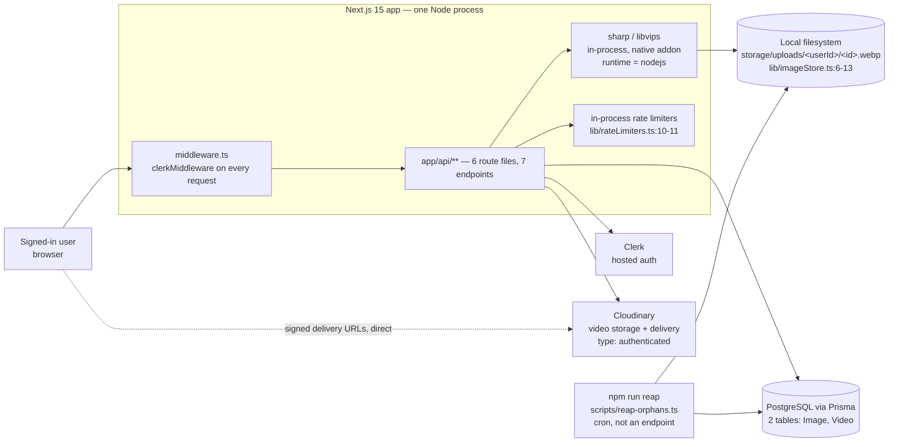
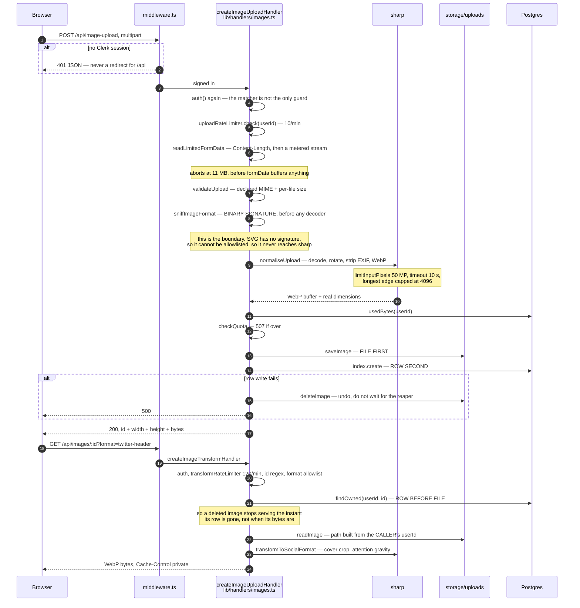
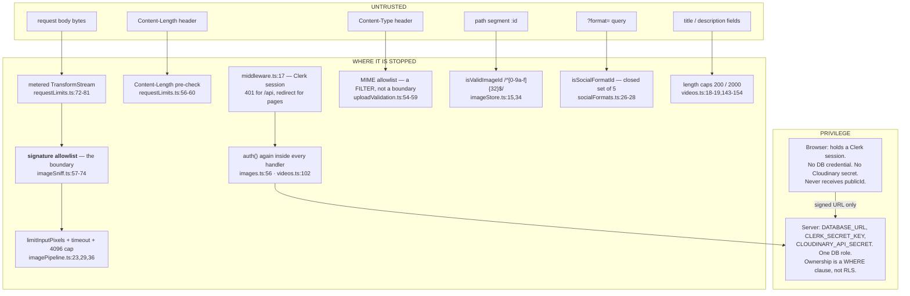
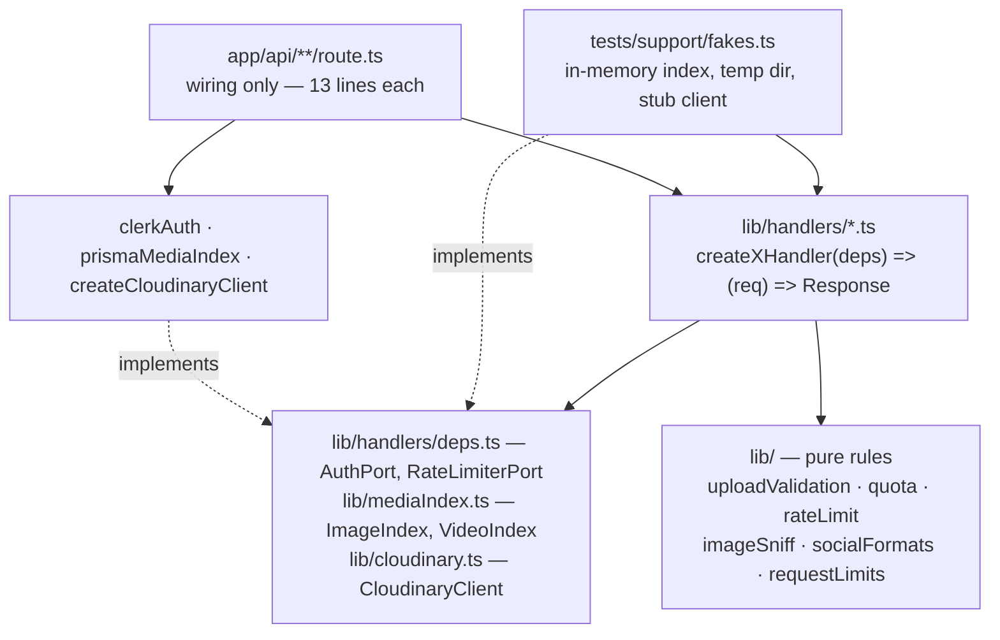
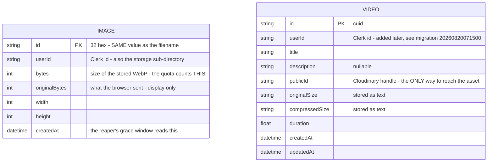
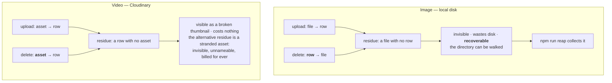

# Architecture

Social Share stores media in two places that cannot be written in one
transaction: a local directory and a Cloudinary account, each with an index row
in Postgres. Most of the interesting structure in this codebase is a consequence
of that — the write orders, the delete orders, the reaper, and the things that
are deliberately *not* reconciled.

Everything below cites the file and line it came from. For *why* a choice was
made, and what was rejected, see [DECISIONS.md](./DECISIONS.md); this document
does not restate that.

---

## Contents

1. [System context](#1-system-context)
2. [One image, from upload to delivery](#2-one-image-from-upload-to-delivery)
3. [Trust boundaries](#3-trust-boundaries)
4. [Component boundaries](#4-component-boundaries)
5. [Data model](#5-data-model)
6. [Crash consistency: two stores, no transaction](#6-crash-consistency-two-stores-no-transaction)
7. [Concurrency](#7-concurrency)
8. [Failure modes](#8-failure-modes)
9. [What this architecture does not do](#9-what-this-architecture-does-not-do)
10. [Defects found while writing this](#10-defects-found-while-writing-this)

---

## 1. System context



Four external dependencies, and one of them is the machine's own disk. There is
no queue, no object store, no cache tier, no CDN in front of the app, and no
image API — every transform runs in this process through libvips
(`lib/imagePipeline.ts:6-15`). The consequence is stated up front in that file:
an upload's cost is this server's cost, which is why so much of §3 is about
bounding it.

The one thing the browser talks to directly is Cloudinary, and only via URLs
this server signed for it (`lib/cloudinary.ts:77-91`).

---

## 2. One image, from upload to delivery



`sniffImageFormat` (step 8) is the step that is easy to miss and is the whole
defence: `lib/imageSniff.ts:1-22` records the measurement — 119 bytes of SVG
declared `image/png` passed the MIME filter and the 10 MB cap, and sharp then
rasterised it into 8000×8000 pixels and 4967 ms of CPU. The size cap bounds the
*compressed* input, and the cost lives in the *decoded* pixels, so it was
bounding the wrong axis. (The flowchart in the README's "The image path, end to
end" section predates this step and does not show it; the sequence above does.)

Step map:

| Step | File |
| --- | --- |
| session gate, 401-vs-redirect split | `middleware.ts:17-42` |
| handler wiring (one line per route) | `app/api/image-upload/route.ts:10-13` |
| body metering | `lib/requestLimits.ts:50-102` |
| declared-type / size filter | `lib/uploadValidation.ts:60-89` |
| **format decided from bytes** | `lib/imageSniff.ts:57-74`, called at `lib/handlers/images.ts:86` |
| decode + normalise + EXIF strip | `lib/imagePipeline.ts:61-83` |
| quota | `lib/quota.ts:59-77`, called at `lib/handlers/images.ts:114-129` |
| file write, then row | `lib/handlers/images.ts:131-151` |
| transform on demand | `lib/imagePipeline.ts:93-118`, `lib/handlers/images.ts:192-252` |

The video path is the same skeleton with a remote store:
`lib/handlers/videos.ts:98-189`. It differs in one structural way — the
Cloudinary client is resolved **before** the body is read
(`videos.ts:107-115`), because there is no point streaming 200 MB into memory to
discover the server has no credentials to send it with.

---

## 3. Trust boundaries



**The claim-versus-fact split is the design idea here.** `validateUpload` reads
the `Content-Type` the browser typed, and its own doc comment says so plainly:
*"this is a first filter and not a security boundary"*
(`lib/uploadValidation.ts:54-59`). The boundary is `sniffImageFormat`, which
matches a binary signature and therefore works against the *class* of the
bug rather than one instance — SVG is text and has no signature, so it cannot be
on the list, and neither can an archive or a document however it is labelled
(`lib/imageSniff.ts:16-22`).

The same claim-versus-fact rule runs through the rest:

- `Content-Length` is checked when present, and then the body stream is metered
  regardless, because a client can lie in the header or use
  `Transfer-Encoding: chunked` (`lib/requestLimits.ts:14-24`).
- `originalSize` and `compressedSize` on a video are measured server-side from
  the buffer and Cloudinary's response (`lib/handlers/videos.ts:173-177`). They
  used to come from a form field, so the compression figure was whatever the
  client claimed.
- The browser is never given a Cloudinary `publicId`
  (`lib/handlers/videos.ts:42-50`). While the list query was unscoped, every
  account received every other account's ids — and because uploads were
  public-delivery, those ids were, on their own, working download links. Assets
  are now `type: "authenticated"` (`lib/cloudinary.ts:138`) and the server hands
  out three finished signed URLs per row it owns (`lib/cloudinary.ts:182-211`).

**Privilege is coarse and worth being honest about.** There are exactly two
tiers: the browser, which holds a Clerk session and no credential of any kind;
and the server, which holds every secret and connects to Postgres as one role
with full rights. There is no row-level security. **Ownership is enforced by a
`WHERE` clause and nothing else** — `findFirst({ where: { id, userId } })`
rather than `findUnique({ where: { id } })`, with the reason written at
`lib/prismaMediaIndex.ts:18-20`: the owner has to be *part of the predicate*, or
the id alone returns another user's row and the check becomes something a future
caller has to remember. Every read and delete in `lib/prismaMediaIndex.ts` is
owner-scoped except the two the reaper uses, which are marked as such in the
port itself (`lib/mediaIndex.ts:38-45`).

Two smaller boundary properties:

- **Auth is checked twice**, in the middleware and again in each handler
  (`lib/handlers/videos.ts:316-317`), so protection does not depend on the
  matcher regex staying correct.
- **Path traversal is refused twice** for deletes — at the handler
  (`lib/handlers/images.ts:280-286`) and again inside `resolveImagePath`, which
  throws rather than resolving outside the root (`lib/imageStore.ts:42-50`). The
  comment gives the asymmetry: a read leaks a file, a delete destroys one.
- **"Not yours" and "not there" are the same answer** — 404, never 403
  (`lib/handlers/images.ts:288-294`, `lib/handlers/videos.ts:229-234`), so the
  endpoint is not an oracle for which ids exist.

---

## 4. Component boundaries

The organising pattern is **ports and factories**: a handler is a function
returned by a factory that takes its dependencies, and each `route.ts` is one
line of wiring.



| Module | Owns | Must not touch |
| --- | --- | --- |
| `app/api/**/route.ts` | wiring the real dependencies into a factory; the `runtime = "nodejs"` pin | logic of any kind |
| `lib/handlers/*.ts` | HTTP status codes, ordering, error messages | Prisma, `fs`, the Cloudinary SDK — all three arrive as ports |
| `lib/mediaIndex.ts` | the shape of the two database ports | Prisma. It is types only |
| `lib/prismaMediaIndex.ts` | every `prisma.image` / `prisma.video` call outside the reaper script | HTTP |
| `lib/imageStore.ts` | every `fs` call, and the path scheme | the database |
| `lib/cloudinary.ts` | the SDK, config resolution, URL signing, error classification | Next.js, Prisma — it imports neither |
| `lib/socialFormats.ts` | the preset table | sharp — deliberately split out of `imagePipeline.ts` so the browser bundle can import it without pulling in a native addon (`socialFormats.ts:1-5`) |

**Which of these are actually enforced:**

1. **`sharp` must not reach the client bundle** — enforced by the split at
   `lib/socialFormats.ts:1-5` plus `export const runtime = "nodejs"` on every
   route file. Importing `imagePipeline.ts` into a client component would fail
   the build, not warn.
2. **Handler purity is enforced by the tests.** `tests/imageHandlers.test.ts`
   and `tests/videoHandlers.test.ts` run the real handler functions against
   fakes; a handler that reached for `prisma` directly could not run there. This
   is the strongest boundary in the repo, because it is exercised on every
   `npm test`.
3. **Ownership scoping is enforced by the port's shape.** `ImageIndex.findOwned`
   and `deleteOwned` both take `userId` as a required first argument
   (`lib/mediaIndex.ts:27,34`); there is no un-scoped read on the interface at
   all except the two the reaper needs, which are grouped under an explicit
   comment (`lib/mediaIndex.ts:38`).

What is **not** enforced: nothing stops a new route from importing `prisma`
directly, and nothing stops `lib/` growing a module that reads `process.env` at
import time — the pattern of passing an `EnvLike` (`lib/env.ts:11`) is
convention, held up by the fact that the tests pass three-key objects
(`lib/quota.ts:17-20`, `lib/cloudinary.ts:42`).

---

## 5. Data model

Two tables. That is the whole schema.



There is no foreign key between them and no user table: identity lives in Clerk,
and `userId` is an opaque string this app never joins on
(`prisma/schema.prisma:19-21,43-44`). Both tables carry the same composite index
`(userId, createdAt)` because both have exactly one list query — one owner's
rows, newest first (`prisma/schema.prisma:32,54`).

The non-obvious parts:

**`Image.id` is not generated by the database.** It is a 32-hex value minted by
`newImageId()` (`lib/imageStore.ts:30-32`) and used *both* as the primary key and
as the filename, so a row and its file address each other with no second lookup
(`prisma/schema.prisma:40-42`). That is what makes the reaper a set difference
rather than a join.

**`Image.bytes` is the encoded size, not the uploaded size.** The quota counts
the WebP that actually lands on disk, which is why the quota check runs *after*
`normaliseUpload` and not before — checking the uploaded size would be cheaper
and would reject files that would have fitted
(`lib/handlers/images.ts:110-113`).

**`Video.userId` did not exist originally**, and the migration that adds it is a
three-step dance because `prisma migrate diff` emits a single
`ADD COLUMN ... NOT NULL` that aborts on a populated table
(`prisma/migrations/20260820071500_video_user_id/migration.sql`). Pre-existing
rows have no recoverable owner, so they are tagged `legacy-unknown-owner` and
left in place — they stop appearing in anyone's list rather than being deleted.

**`originalSize` / `compressedSize` are `String`.** A historical shape, kept
because migrating them is a data migration DECISIONS.md judged not worth it for
this project.

---

## 6. Crash consistency: two stores, no transaction

This is the part of the system worth reading the code for. Postgres holds the
index; the bytes are somewhere else. No transaction spans both, so **every
write and every delete has a moment where the two disagree**, and the design
choice is *which* disagreement to leave behind.



The rule underneath both, in DECISIONS.md's words: **delete last the thing that
lets you find the others.** The filesystem is enumerable, so an image row is
expendable. A Cloudinary asset can be named only by the `publicId` in its row,
so that row is not (`lib/handlers/videos.ts:191-211`).

Both upload handlers also compensate explicitly rather than waiting for a
sweeper: if the row write fails, the bytes just written are removed again before
the 500 goes out (`lib/handlers/images.ts:144-151`,
`lib/handlers/videos.ts:180-187`).

### The reaper, and why its two sides are not symmetrical

`lib/reaper.ts` reconciles disk against index in both directions, but the two
directions carry wildly different blast radii, and the file says so at
`lib/reaper.ts:25-47`: deleting an orphan **file** costs one image; deleting
orphan **rows** costs the whole index if the scan came back empty for a reason
that has nothing to do with the rows. `listStoredImages` answers `[]` for a
missing directory, because an empty store is not a crash
(`lib/imageStore.ts:126-130`) — and an unset `IMAGE_STORAGE_DIR`, an ephemeral
volume, or a process started from the wrong working directory all produce
exactly that. The first version of the file did precisely this.

Three guards, all on the row side:

1. **The root must exist and be a directory**, or the sweep throws
   `UntrustworthyScanError` rather than deleting anything
   (`lib/reaper.ts:110-127`).
2. **Zero files with rows still present is treated as a broken scan**, not as a
   table full of orphans (`lib/reaper.ts:142-150`). "That is a broken or empty
   mount far more often than it is N genuinely orphaned rows, and the cost of
   guessing wrong is the whole index."
3. **A grace window**, default 15 minutes, on rows as well as files
   (`lib/reaper.ts:79-92`, applied at `:161,:173`).

And one ordering that is easy to overlook: **rows are read before the directory
is scanned** (`lib/reaper.ts:138-140`). An upload writes its file and then its
row, so reading rows first means every row this sweep considers had its file
written before the scan started — which closes the window where an upload
landing mid-sweep would have looked like a row with no file.

It is a script, not an endpoint (`scripts/reap-orphans.ts`), because deleting
other people's files needs an administrator identity and this app has no notion
of one.

---

## 7. Concurrency

Four races exist and all four are handled. Three by the same move — make the
decision a single statement, or make the outcome order-independent. The fourth,
the storage quota, is the one place that needed a lock: it is the only decision
here whose input is an aggregate over rows that do not exist yet, and there is
nothing for a second caller to block on until one is taken.

**Delete is one statement, not read-then-write.**
`deleteOwned` is `deleteMany({ where: { id, userId } })`
(`lib/prismaMediaIndex.ts:31-34`), and the count it returns *is* the
authorisation answer: `0` means "not yours or not there", reported as 404
(`lib/handlers/images.ts:288-294`). A `findFirst` followed by a `delete` would
open a window in which the row could change hands between the two — and would
need an extra round trip to prove nothing. The port documents the property at
`lib/mediaIndex.ts:29-34`.

**A concurrent video delete is a success, not a conflict.**
`createVideoDeleteHandler` reports `rowsRemoved: 0` when another request removed
the row between the read and the write (`lib/handlers/videos.ts:289-299`). The
asset is gone either way, so the outcome is the same; it is surfaced rather than
glossed over.

**A double delete of an image is idempotent by construction.**
`deleteImage` returns `false` for `ENOENT` rather than throwing
(`lib/imageStore.ts:80-101`), so a retried delete — or a delete of a file the
reaper already collected — lands on the intended end state instead of an error.
The reaper relies on the same property so a concurrent delete does not fail a
whole sweep (`lib/reaper.ts:182-188`).

**The reaper racing a live upload** is handled by the grace window and the
read-rows-first ordering above, not by locking.

**The storage quota is one transaction, serialised per user.**
`createWithinQuota` takes `pg_advisory_xact_lock(hashtextextended(userId, 0))`,
sums, decides and inserts (`lib/prismaMediaIndex.ts`). It used to be a genuine
read-then-write — `usedBytes()`, `checkQuota`, a disk write, then `create()` —
which admitted 240 bytes against a 100-byte quota in a four-way reproduction.
The lock is transaction-scoped, so it releases on commit or rollback, and it is
per user, so different users never contend. See §10.1 for why a plain
transaction, a conditional INSERT and a `CHECK` constraint all fail to hold this
one.

The rate limiter is in-process by design (`lib/rateLimit.ts:1-9`): a `Map` of
fixed windows, pruned when it exceeds 1000 keys (`lib/rateLimit.ts:44-46`).
Within one process it is exact, because JavaScript's single-threaded event loop
means `check()` runs to completion without interleaving. Across processes it
does not exist.

---

## 8. Failure modes

| Event | What happens | Where |
| --- | --- | --- |
| **Anonymous request to `/api/*`** | **401 JSON**, never a redirect. A redirected XHR resolves with a 200 HTML document, which the caller then mistakes for success. | `middleware.ts:22-28` |
| **Anonymous page load** | redirect to `/sign-in`, unless the route is public | `middleware.ts:29-32` |
| **Cloudinary variables missing or blank** | **503** naming the missing variables, and saying the image features keep working without it. Not 500 — nothing threw; the server is correctly reporting an unconfigured dependency. | `lib/cloudinary.ts:42-59` |
| **Cloudinary credentials rejected (401/403)** | 502 naming which three variables to check | `lib/cloudinary.ts:252-260` |
| **Cloudinary unreachable (ENOTFOUND / ECONNREFUSED / ETIMEDOUT / EAI_AGAIN)** | 502 naming the syscall code | `lib/cloudinary.ts:244-250` |
| **Cloudinary rate limits the account (420/429)** | 429 passed through | `lib/cloudinary.ts:262-267` |
| **Cloudinary rejects the file (400)** | 400 with Cloudinary's own message, which is the useful part ("Video file is corrupt") | `lib/cloudinary.ts:269-276` |
| **Cloudinary unconfigured during a *delete*** | The delete **refuses** — 503 — rather than dropping the row. Dropping it would orphan the remote asset silently. Fails closed. | `lib/handlers/videos.ts:236-244` |
| **Cloudinary answers `"not found"` on destroy** | Asks the *other* delivery type first (`type: "upload"`, for assets predating the switch). If both say not found, the row is **kept** and the caller gets 502. That string is not proof of absence — the wrong cloud answers it for every id. | `lib/cloudinary.ts:151-180`, `lib/handlers/videos.ts:258-287` |
| **Prisma write fails after the bytes are stored** | The bytes are removed again, then 500. Both media paths. | `lib/handlers/images.ts:144-151`, `lib/handlers/videos.ts:180-187` |
| **Body larger than the cap** | 413 after ~12 MB read for an image, from the `Content-Length` pre-check or the metered stream. Nothing is buffered. | `lib/requestLimits.ts:56-60,72-81` |
| **Body is a decode bomb** | Refused by the signature allowlist before a decoder runs; if the allowlist is ever widened by mistake, `limitInputPixels` (50 MP) and a 10 s libvips timeout are the backstop. | `lib/imageSniff.ts:57-74`, `lib/imagePipeline.ts:23,29` |
| **User over quota** | **507 Insufficient Storage**, not 413. A 413 says "send a smaller file", which is wrong here: the request may be tiny and will keep failing until something is deleted. | `lib/quota.ts:37-53` |
| **Row present, file missing** | 404 from the transform route. The row is an orphan the reaper collects. | `lib/handlers/images.ts:226-230` |
| **Storage root missing when the reaper runs** | The sweep **refuses** and throws, rather than treating every row as an orphan. A sweep that refuses is an alert; a sweep that runs on a bad scan is a restore-from-backup. | `lib/reaper.ts:98-127` |
| **Postgres unreachable** | Prisma throws; the video list route catches and returns 500 (`videos.ts:336-339`), the image routes let it propagate to Next's 500. No retry, no backoff, anywhere. | — |
| **Dev hot reload** | The Prisma client is cached on `globalThis`, or every reload would open a new pool until Postgres refuses connections. | `lib/prisma.ts:3-17` |

There are **no configured timeouts** on Prisma or on the Cloudinary SDK, and no
retry logic of any kind. The only wall-clock bound in the system is the 10-second
libvips timeout (`lib/imagePipeline.ts:29`).

---

## 9. What this architecture does not do

- **It does not run on more than one instance.** Two things break, in order of
  severity: image bytes live on the local disk
  (`lib/imageStore.ts:20-28`), so instance B cannot read what instance A stored;
  and the rate-limit counters live in a `Map` in the process
  (`lib/rateLimiters.ts:5-11`), so N instances mean N× the budget. The
  filesystem calls are deliberately isolated in one module so they can be
  swapped for object storage.
- **It does not survive an ephemeral container filesystem.** Same module, same
  reason. Worse, an ephemeral volume is exactly the condition the reaper's
  guards exist to detect (`lib/reaper.ts:29-35`).
- **Nothing in the app runs the reaper.** `npm run reap` has to be put in cron by
  hand. A deployment that never runs it accumulates orphan files silently.
- **There is no admin identity.** No endpoint can act on another user's data,
  which is why both maintenance jobs are scripts rather than routes: `npm run
  reap` for the image store, and `npm run forget-video` for a stranded `Video`
  row (§10.2). Both inherit the shell's authority, which is the only
  administrator identity this app has.
- **In-process state that does not replicate:** the rate-limit windows
  (`lib/rateLimit.ts:32`), the Prisma client on `globalThis`
  (`lib/prisma.ts:11-16`), and the Cloudinary SDK's global config, which is why
  `configure()` is re-applied on every call rather than once at import
  (`lib/cloudinary.ts:111-123`).
- **A large upload is held whole in memory.** `formData()` materialises the
  body, so a legitimate 200 MB video costs ~200 MB of RSS. The metering changes
  the ceiling from "whatever the caller sends" to "the configured limit"; it
  does not make a big upload cheap (`lib/requestLimits.ts:20-24`). There is no
  resumability and no direct-to-storage upload.
- **Transform output is not cached server-side.** Every
  `GET /api/images/:id?format=…` re-decodes the stored WebP and re-crops it. The
  only cache is `Cache-Control: private, max-age=3600` in the browser
  (`lib/handlers/images.ts:238`).
- **There is no video quota.** Video bytes live in Cloudinary and are governed by
  that account's plan, which this app cannot see from a request handler
  (`lib/quota.ts:6-11`).
- **There is no row-level security and no per-user database credential.** One
  Postgres role, full rights; ownership is a `WHERE` clause (§3).
- **The video path has never been run against a live Cloudinary account** by
  whoever wrote the current code. `tests/videoHandlers.test.ts` proves the
  handler against a stub; it does not prove the SDK. DECISIONS.md, "What the
  video tests do not prove", is explicit about the difference.
- **No end-to-end or browser tests.** The pages are not covered at all.

---

## 10. Defects found while writing this document — and fixed

### 10.1 The storage quota was a read-then-write race — FIXED

`POST /api/image-upload` read the quota, decided, and wrote, with nothing in
between that would serialise two callers:

```
115   usedBytes: await index.usedBytes(userId),   // SUM(bytes) WHERE userId = ?
119   if (!quota.ok) { ... 507 ... }
132   await saveImage(userId, id, normalised.buffer, root);
136   record = await index.create({ ... bytes: normalised.bytes ... });
```

Two uploads that arrived together both computed `usedBytes` from the same
snapshot, both passed `checkQuota`, and both then inserted. There was no
transaction around the pair, no `SELECT … FOR UPDATE`, and no `CHECK` constraint
that could refuse the second write. And the window is not narrow: line 132 is a
disk write, sitting between the decision and the row.

The overshoot was bounded by the upload limiter, not by the quota: 10 uploads
per minute per user at up to 10 MB each means a user sitting on the boundary
could exceed it by roughly 100 MB per minute *per process* — and because the
limiter is in-process (§7), a second instance doubles that. On the 100 MB
default that is a 2× overshoot per minute of sustained parallel uploading.

**Reproduced** against PostgreSQL: four concurrent uploads of 60 bytes against a
100-byte quota, with the handler's own disk write between the check and the
insert. All four were admitted; 240 bytes were stored.

**Fixed** with `ImageIndex.createWithinQuota` — the sum, the decision and the
insert in one transaction, serialised per user by `pg_advisory_xact_lock` on the
user id (`lib/prismaMediaIndex.ts`).

The lock is the part that does the work, and it is worth saying why the two
cheaper answers do not:

| candidate | why it does not hold |
| --- | --- |
| a transaction around the read and the write | under READ COMMITTED both callers evaluate `SUM(bytes)` against their own snapshot, and Postgres cannot lock rows that do not exist yet — the second has nothing to block on |
| `INSERT … SELECT … WHERE (SELECT SUM(bytes) …) + ? <= quota` | same reason: the subquery is evaluated per snapshot |
| a `CHECK` constraint on the table | the quota is per user and configurable at runtime (`IMAGE_STORAGE_QUOTA_BYTES`); a table constraint cannot see either |
| a `user_storage` row with `UPDATE … WHERE used + ? <= quota` | this does work — the row lock serialises it — at the cost of a second source of truth for a number the `Image` rows already hold, and a reconciliation job to keep them agreeing |
| a per-user in-process mutex | inherits the single-instance limitation the rest of the app has (§7), and this is the one limit where a second instance doubling the overshoot is the whole problem |

The advisory lock is transaction-scoped, so it releases on commit or rollback
and cannot leak, and it is derived from the user id, so two uploads by different
users never contend.

The cheap pre-check stays, demoted in the comments to what it always was: an
optimisation that turns the common "already full" case into a 507 without
writing a file that would only be unlinked again. A refusal from the atomic
insert unlinks the file it just wrote, which is the same compensating unlink the
index-failure path already performed.

Covered by three handler cases driving the real handler concurrently, and by
`tests/prismaQuota.test.ts` against a real PostgreSQL — eight concurrent
60-byte inserts against a 300-byte quota admit exactly five, and two different
users do not serialise each other.

### 10.2 The README contradicted the code about video deletes — FIXED, and the owner action now exists

README "Media lifecycle" said the residue of a failed video delete was:

> a row pointing at an asset that has gone — visible, and **fixed by pressing
> delete again**

The code does the opposite, deliberately and recently. `destroyVideo` asks both
delivery types, and if both answer `"not found"` the handler **keeps the row and
returns 502** (`lib/handlers/videos.ts:276-287`) — because that string is not
proof of absence: a destroy against the wrong cloud answers it for every id.
DECISIONS.md already agreed with the code. The README paragraph was a leftover
from before the change and told a reader the exact opposite of what happens.

The second half of the problem was worse, because it was not a stale sentence
but a missing mechanism: **there was no owner action**. No endpoint, script or
npm task removed a `Video` row without a successful Cloudinary destroy;
`scripts/reap-orphans.ts` reconciles the image store only, and `VideoIndex` had
no un-scoped delete on it at all. "An owner action" meant direct SQL.

**Fixed** both ways. The README table now points at the mechanism, and the
mechanism exists: `lib/forgetVideo.ts` and
`npm run forget-video -- <videoId> <publicId>`. It reports by default and needs
`--delete` to act, and the `publicId` must match the row's own — which the
operator can only produce by reading the row and looking the asset up in the
Cloudinary console. That is the check, not a convenience: this is the one
operation in the app that throws away the last handle on a remote asset, and
being wrong about it means an asset that is invisible and billed for ever.

It is a script rather than a route for the same reason `npm run reap` is:
deleting another account's row needs an administrator identity and this app has
none, so it inherits the shell's. `VideoIndex` gains `findAny` and `deleteById`,
marked un-scoped and script-only in the same way `ImageIndex.listAll` and
`deleteByIds` already are.

### 10.3 The README's image flowchart was missing the step that matters — FIXED

The `mermaid` flowchart under "The image path, end to end" went
`validateUpload → normaliseUpload` with no node for `sniffImageFormat`, which
sits between them at `lib/handlers/images.ts:86` and is the step the rest of the
README and DECISIONS.md both describe as the actual security boundary. A reader
following the diagram would conclude that decoding is what proves the file is an
image — precisely the belief `lib/imageSniff.ts:1-22` was written to correct.

The node is in the diagram now, with its 415, and the quota nodes were corrected
at the same time: the pre-check is labelled as an optimisation and the atomic
insert appears as the step that can also answer 507.
