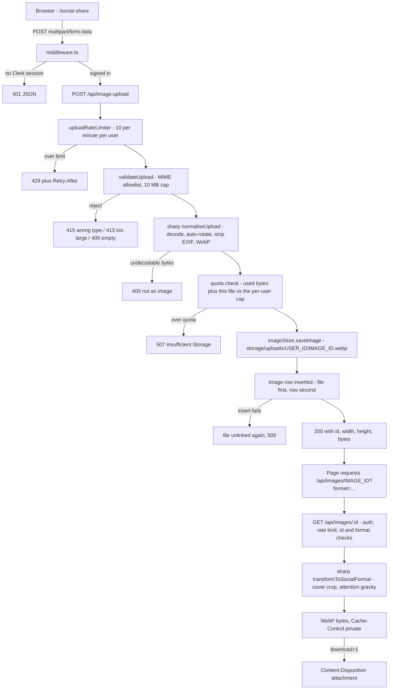

# Social Share

A small Next.js app for signed-in users to upload an image and crop it to the
common social-media aspect ratios, and to upload a video and get a compressed
copy back. Images are processed locally with `sharp`; video goes to Cloudinary.

## Fastest way to see whether this is any good

```bash
npm install
npm test        # 138 tests, ~4 seconds
```

No accounts, no database, no environment variables, no network. That suite is
where the actual work is: the `sharp` pipeline's exact output dimensions, path
traversal rejected on read *and* on delete, the storage quota's boundary byte,
the orphan reaper in both directions, and the real route handlers driven
against an in-memory index and a stubbed Cloudinary. If you only have five
minutes, spend them there and in `DECISIONS.md` rather than on setup.

Running the app itself needs Postgres and a free Clerk key — see [Setup](#setup).

## The image path, end to end


```mermaid
flowchart TD
    A["Browser - /social-share"] -->|"POST multipart/form-data"| B["middleware.ts"]
    B -->|"no Clerk session"| Z1["401 JSON"]
    B -->|"signed in"| C["POST /api/image-upload"]

    C --> D["uploadRateLimiter - 10 per minute per user"]
    D -->|"over limit"| Z2["429 plus Retry-After"]
    D --> E["validateUpload - MIME allowlist, 10 MB cap"]
    E -->|"reject"| Z3["415 wrong type / 413 too large / 400 empty"]
    E --> F["sharp normaliseUpload - decode, auto-rotate, strip EXIF, WebP"]
    F -->|"undecodable bytes"| Z4["400 not an image"]
    F --> Q["quota check - used bytes plus this file vs the per-user cap"]
    Q -->|"over quota"| Z5["507 Insufficient Storage"]
    Q --> G["imageStore.saveImage - storage/uploads/USER_ID/IMAGE_ID.webp"]
    G --> R["Image row inserted - file first, row second"]
    R -->|"insert fails"| Z6["file unlinked again, 500"]
    R --> H["200 with id, width, height, bytes"]

    H --> I["Page requests /api/images/IMAGE_ID?format=..."]
    I --> J["GET /api/images/:id - auth, rate limit, id and format checks"]
    J --> K["sharp transformToSocialFormat - cover crop, attention gravity"]
    K --> L["WebP bytes, Cache-Control private"]
    L -->|"download=1"| M["Content-Disposition attachment"]
```

`DELETE /api/images/:id` reverses it: the row goes first, then the file. The
ordering is the point — see "Media lifecycle" below.

Video takes a different route: `POST /api/video-upload` streams the file to
Cloudinary with `quality: auto`, then records the original and compressed byte
counts in Postgres. `/home` lists the caller's videos and
`components/VideoCard.tsx` builds Cloudinary thumbnail, preview and download
URLs from the stored `publicId`. `DELETE /api/videos/:id` destroys the
Cloudinary asset first and only then removes the row.

## How it works

`middleware.ts` runs Clerk on every request: anonymous page loads are redirected
to `/sign-in`, anonymous `/api/*` calls get a 401 JSON body, and each route
handler calls `auth()` again so protection does not depend on the matcher alone.
An image upload hits `app/api/image-upload/route.ts`, which rate-limits by user
id, checks the declared type and size with `lib/uploadValidation.ts`, then hands
the bytes to `normaliseUpload()` in `lib/imagePipeline.ts` — decoding there is
what actually proves the file is an image, and it strips EXIF on the way through.
`lib/imageStore.ts` writes the result to `storage/uploads/<clerkUserId>/<id>.webp`,
so a later read is scoped to the caller by the path itself.
`app/api/images/[id]/route.ts` re-crops that stored copy on demand to whichever
preset in `lib/socialFormats.ts` the page asked for, using `fit: "cover"` for
exact dimensions and `position: "attention"` to keep the busiest part of the
frame — after checking that the caller owns the matching `Image` row, so a
deleted image stops being served the moment its row is gone rather than when
its bytes are. Both halves use Prisma (`prisma/schema.prisma`: an `Image` row
per stored file, a `Video` row per Cloudinary asset) with every query filtered
by `userId`.


*This screenshot is out of date. It was taken before the `sharp` rewrite and
before the uploads list existed. The layout is the same, but the page now also
shows the stored dimensions, the compression saved, a storage-quota bar, a list
of your uploads with a Delete button on each, and error states. Replacing it
needs a browser and a Clerk account; neither was available when this section
was written, so it is captioned rather than quietly left to mislead.*

## Setup

**Prerequisites:** Node 24 and npm 11 (`.nvmrc` pins the version CI runs;
nothing older has been tested). Plus a PostgreSQL database — see the three
options below.

```bash
git clone https://github.com/vipinsao/ai-saas-webapp.git
cd ai-saas-webapp
npm install

cp .env.example .env           # `.env`, NOT `.env.local` -- see below
npx prisma migrate deploy      # create the Video and Image tables
npm run dev                    # http://localhost:3000
```

> **Copy to `.env`, not `.env.local`.** Next.js reads both; the Prisma CLI
> reads only `.env`. A project set up with `.env.local` alone builds fine and
> then fails on the first Prisma command with
> `Error code: P1012 ... Environment variable not found: DATABASE_URL`. One
> file is read by both tools, so that is the one the instructions use.

**A database, three ways.** Any PostgreSQL will do; set `DATABASE_URL` to point
at it.

| | |
| --- | --- |
| Already have Postgres | set `DATABASE_URL` and skip the rest |
| Docker | `docker compose up -d` starts one matching the example URL — but Docker is not always available, which is why it is not the only option here |
| No Docker, nothing to install | create a free [Neon](https://neon.tech) project (no card) and paste its connection string |

**Clerk keys.** `.env.example` ships syntactically valid *placeholder* keys, not
real ones. They are enough for `npm run build`, `npm start` and the public
landing page to work with no account at all — Clerk parses the format and a
literal `pk_test_...` fails the production build outright. Nobody can sign in
with them, because the widget loads from a domain that does not exist. Get a
free Clerk key (no card, about two minutes) before trying any signed-in page.

**Environment variables** are documented one by one in `.env.example`. The
short version:

| Variable | Needed for | Where to get it |
| --- | --- | --- |
| `DATABASE_URL` | the video list | local Postgres via `docker compose`, or a free Neon project |
| `NEXT_PUBLIC_CLERK_PUBLISHABLE_KEY` | all auth; **the production build fails without it** | Clerk dashboard → API keys |
| `CLERK_SECRET_KEY` | all auth | Clerk dashboard → API keys |
| `NEXT_PUBLIC_CLOUDINARY_CLOUD_NAME` | video only | Cloudinary console → Dashboard |
| `CLOUDINARY_API_KEY` / `CLOUDINARY_API_SECRET` | video only | Cloudinary console → API keys |
| `IMAGE_STORAGE_DIR` | optional | defaults to `./storage/uploads` |
| `IMAGE_STORAGE_QUOTA_BYTES` | optional | per-user cap on the image store, default 100 MB |

Leaving the Cloudinary variables blank is supported: the image features work,
and `/api/video-upload` and `DELETE /api/videos/:id` answer **503** with the
names of the variables that are missing.

**Cost:** nothing here is paid. Cloudinary's free plan (checked 2026-08-20)
requires no credit card and gives 25 monthly credits — one credit is 1,000
transformations *or* 1 GB storage *or* 1 GB of video bandwidth. Clerk and Neon
both have free tiers that do not ask for a card. `sharp` and Postgres cost
nothing at all.

## Commands

```bash
npm run dev        # next dev --turbopack
npm run build      # prisma generate && next build
npm run lint       # eslint .
npm run typecheck  # tsc --noEmit
npm test           # node:test via tsx — 138 tests
npm run reap       # reconcile the image store against the Image table
npm run reap -- --dry-run   # report what it would delete, delete nothing
```

## Tests

`npm test` runs 138 assertions with no network and no database. Nine suites:

| Suite | What it pins down |
| --- | --- |
| `imagePipeline.test.ts` | exact output dimensions for all five presets against a committed fixture, EXIF orientation applied, EXIF metadata gone from the stored copy, upscaling of small sources, rejection of bytes that are not a decodable image |
| `imageStore.test.ts` | id generation and validation, path traversal rejected on read **and on delete**, one user's id not resolving to another user's file, and the directory scan the reaper depends on |
| `imageHandlers.test.ts` | the real upload / list / transform / delete handlers against an in-memory index and a temp directory: delete happy path, cross-user delete answered 404, traversing ids rejected without destroying anything, quota rejection, and the file being removed again when the row cannot be written |
| `videoHandlers.test.ts` | the real video upload and delete handlers against a fake Cloudinary client: size accounting, ownership, every error path, and the delete that removes the remote asset before the row |
| `cloudinaryConfig.test.ts` | missing, blank and misspelled environment variables; and each Cloudinary failure mapped to its own status and message |
| `quota.test.ts` | the boundary byte, the 507 status, and a misconfigured limit falling back to the default |
| `reaper.test.ts` | orphans reaped in both directions, the grace window that stops it racing a live upload, and the dry run |
| `uploadValidation.test.ts` | every accept and reject path, including the exact status code per failure |
| `rateLimit.test.ts` | window accounting and expiry, driven by an injected clock |

Each route handler is built by a factory in `lib/handlers/` that takes its
dependencies as arguments, and every `route.ts` is one line of wiring. The
tests call the same functions the routes export, so the status codes and the
write ordering asserted are the ones a request actually gets.

There are still no browser tests, and no test talks to Postgres, Clerk or
Cloudinary.

## Media lifecycle

Both stores are written and deleted in a deliberate order, and the two orders
are opposites. The reasoning is in DECISIONS.md; the short version:

| | write | delete | residue after a crash in between |
| --- | --- | --- | --- |
| image (local disk) | file, then row | **row, then file** | a file with no row — invisible, and findable again by scanning the directory |
| video (Cloudinary) | asset, then row | **asset, then row** | a row pointing at an asset that has gone — visible, and fixed by pressing delete again |

The rule behind both: whatever lets you *find* the other half is deleted last.
The filesystem can be walked, so an image row is expendable; a Cloudinary asset
can only be named by the `publicId` in its row, so that row is not.

`npm run reap` reconciles the image store with the `Image` table in both
directions — files with no row, and rows with no file. Files younger than 15
minutes are left alone, because an upload writes the file before the row and
the reaper must not race a live request. Run it from cron; it is a script
rather than an endpoint because deleting other people's files needs an
administrator identity and this app has no notion of one.

Each account has a storage quota (`IMAGE_STORAGE_QUOTA_BYTES`, default 100 MB).
Going over it returns **507 Insufficient Storage**, not 413 — a 413 would tell
the user to send a smaller file, when what they have to do is delete something.

## Tech stack

Everything below is in `package.json`.

- **Next.js 15.5** (App Router) with **React 19** and TypeScript 5.7
- **Clerk** (`@clerk/nextjs`) for authentication
- **Prisma 6** with PostgreSQL
- **sharp 0.35** for local image decoding, cropping and WebP encoding
- **Cloudinary** (`cloudinary`, `next-cloudinary`) for video upload and delivery
- **Tailwind CSS 3** with **daisyUI**, `lucide-react` icons, `react-toastify`
- `axios`, `dayjs`, `filesize`
- `tsx` + Node's built-in `node:test` runner

## Notes and limitations

This is a small project: **37 TypeScript files outside `tests/`** (two of them
config — `next.config.ts` and `tailwind.config.ts`), **9 test files** plus one
shared fixture module, **2 database tables**, **6 pages** and **7 HTTP
endpoints across 6 route files**. Re-derive any of those with:

```bash
git ls-files '*.ts' '*.tsx' | grep -v '^tests/' | wc -l   # 37
git ls-files 'tests/*.test.ts' | wc -l                     # 9
grep -c '^model ' prisma/schema.prisma                     # 2
```

It is a working vertical slice of upload → validate → transform → store →
deliver → delete, not a product.

**The repository is still named `ai-saas-webapp`**, from an earlier and
inaccurate description of what it does. There is no machine learning here.
Renaming it is the owner's action and is pending; GitHub keeps a redirect from
the old name, so nothing breaks when it happens. `package.json` says
`cloudinary-saas` for the same historical reason.

Known gaps, in rough order of how much they would matter:

- **The video path has never been run against a live Cloudinary account by the
  people who wrote the current code.** It is covered end to end by
  `tests/videoHandlers.test.ts` against a stubbed client, which proves the
  handler; it does not prove the SDK. See DECISIONS.md, "What the video tests
  do not prove".
- **Image storage is a local directory.** It does not survive an ephemeral
  container filesystem and does not work across multiple instances. The
  filesystem calls are isolated in `lib/imageStore.ts` so they can be swapped
  for object storage.
- **Rate limiting is per-process.** Counters reset on restart and are not
  shared between instances. See DECISIONS.md.
- **The reaper has to be scheduled by hand.** Nothing in the app runs it.
- **Video is only compressed, not analysed.** `quality: auto` and
  `fetch_format: mp4` are the whole transformation. There is no machine
  learning anywhere in this repo.
- **No browser or end-to-end tests.** The route handlers are covered by
  `node:test` suites that call them directly; the pages are not covered at all.
- **The video upload is a single buffered request**, so a large file is held in
  memory on the server. The browser now shows upload progress, but there is no
  resumability.
- **`components/VideoCard.tsx` pulls in `next-cloudinary` (~162 kB) to build
  three URL strings.** Hand-written template strings would remove most of
  `/home`'s JavaScript. It has been left alone because the transformation
  strings cannot be verified without a live Cloudinary account, and a wrong URL
  fails silently as a broken image.

An earlier version of this README described distributed computing, Kubernetes,
AI analysis pipelines and an API ecosystem. None of that existed then or now;
it has been replaced with what the code actually does.

## Licence

MIT — see [LICENSE](LICENSE).
