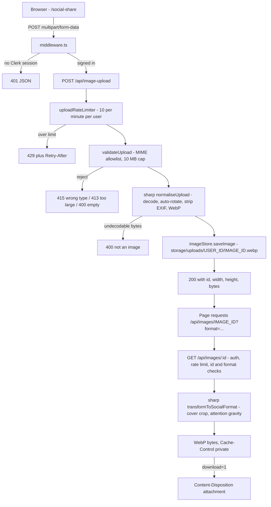

# Social Share

A small Next.js app for signed-in users to upload an image and crop it to the
common social-media aspect ratios, and to upload a video and get a compressed
copy back. Images are processed locally with `sharp`; video goes to Cloudinary.

## The image path, end to end


```mermaid
flowchart TD
    A["Browser - /social-share"] -->|"POST multipart/form-data"| B["middleware.ts"]
    B -->|"no Clerk session"| Z1["401 JSON"]
    B -->|"signed in"| C["POST /api/image-upload"]

    C --> D["uploadRateLimiter - 10 per minute per user"]
    D -->|"over limit"| Z2["429 plus Retry-After"]
    D --> E["validateUpload - MIME allowlist, 10 MB cap"]
    E -->|"reject"| Z3["415 wrong type / 413 too large / 400 empty"]
    E --> F["sharp normaliseUpload - decode, auto-rotate, strip EXIF, WebP"]
    F -->|"undecodable bytes"| Z4["400 not an image"]
    F --> G["imageStore.saveImage - storage/uploads/USER_ID/IMAGE_ID.webp"]
    G --> H["200 with id, width, height, bytes"]

    H --> I["Page requests /api/images/IMAGE_ID?format=..."]
    I --> J["GET /api/images/:id - auth, rate limit, id and format checks"]
    J --> K["sharp transformToSocialFormat - cover crop, attention gravity"]
    K --> L["WebP bytes, Cache-Control private"]
    L -->|"download=1"| M["Content-Disposition attachment"]
```

Video takes a different route: `POST /api/video-upload` streams the file to
Cloudinary with `quality: auto`, then records the original and compressed byte
counts in Postgres. `/home` lists the caller's videos and `components/VideoCard.tsx`
builds Cloudinary thumbnail and hover-preview URLs from the stored `publicId`.

## How it works

`middleware.ts` runs Clerk on every request: anonymous page loads are redirected
to `/sign-in`, anonymous `/api/*` calls get a 401 JSON body, and each route
handler calls `auth()` again so protection does not depend on the matcher alone.
An image upload hits `app/api/image-upload/route.ts`, which rate-limits by user
id, checks the declared type and size with `lib/uploadValidation.ts`, then hands
the bytes to `normaliseUpload()` in `lib/imagePipeline.ts` — decoding there is
what actually proves the file is an image, and it strips EXIF on the way through.
`lib/imageStore.ts` writes the result to `storage/uploads/<clerkUserId>/<id>.webp`,
so a later read is scoped to the caller by the path itself.
`app/api/images/[id]/route.ts` re-crops that stored copy on demand to whichever
preset in `lib/socialFormats.ts` the page asked for, using `fit: "cover"` for
exact dimensions and `position: "attention"` to keep the busiest part of the
frame. The video half uses Prisma (`prisma/schema.prisma`, one `Video` model)
and Cloudinary, with every query filtered by `userId`.


*Screenshot taken before the `sharp` rewrite — the layout is the same, but the
page now also shows stored dimensions, compression saved, and error states.*

## Setup

**Prerequisites:** Node 24 (the version CI runs), npm 11, and a PostgreSQL
database. `docker compose up -d` in this repo starts one that matches the
example connection string.

```bash
git clone https://github.com/vipinsao/ai-saas-webapp.git
cd ai-saas-webapp
npm install

cp .env.example .env.local     # then fill in the values

docker compose up -d           # optional: local Postgres
npx prisma migrate deploy      # create the Video table
npm run dev                    # http://localhost:3000
```

**Environment variables** are documented one by one in `.env.example`. The
short version:

| Variable | Needed for | Where to get it |
| --- | --- | --- |
| `DATABASE_URL` | the video list | local Postgres via `docker compose`, or a free Neon project |
| `NEXT_PUBLIC_CLERK_PUBLISHABLE_KEY` | all auth; **the production build fails without it** | Clerk dashboard → API keys |
| `CLERK_SECRET_KEY` | all auth | Clerk dashboard → API keys |
| `NEXT_PUBLIC_CLOUDINARY_CLOUD_NAME` | video only | Cloudinary console → Dashboard |
| `CLOUDINARY_API_KEY` / `CLOUDINARY_API_SECRET` | video only | Cloudinary console → API keys |
| `IMAGE_STORAGE_DIR` | optional | defaults to `./storage/uploads` |

Leaving the Cloudinary variables blank is supported: the image features work
and `/api/video-upload` returns a 500 that says the credentials are missing.

**Cost:** nothing here is paid. Cloudinary's free plan (checked 2026-08-20)
requires no credit card and gives 25 monthly credits — one credit is 1,000
transformations *or* 1 GB storage *or* 1 GB of video bandwidth. Clerk and Neon
both have free tiers that do not ask for a card. `sharp` and Postgres cost
nothing at all.

## Commands

```bash
npm run dev        # next dev --turbopack
npm run build      # prisma generate && next build
npm run lint       # next lint
npm run typecheck  # tsc --noEmit
npm test           # node:test via tsx — 46 tests
```

## Tests

`npm test` runs 46 assertions over the pure logic, with no network and no
database:

- `tests/imagePipeline.test.ts` — exact output dimensions for all five presets
  against a committed fixture, EXIF orientation applied, EXIF metadata gone
  from the stored copy, upscaling of small sources, and rejection of bytes that
  are not a decodable image.
- `tests/imageStore.test.ts` — id generation and validation, path traversal
  rejected, and one user's id not resolving to another user's file.
- `tests/uploadValidation.test.ts` — every accept and reject path, including
  the exact status code per failure.
- `tests/rateLimit.test.ts` — window accounting and expiry, driven by an
  injected clock.

There are no HTTP-level, database or browser tests.

## Tech stack

Everything below is in `package.json`.

- **Next.js 15.1.3** (App Router) with **React 19** and TypeScript 5.7
- **Clerk** (`@clerk/nextjs`) for authentication
- **Prisma 6** with PostgreSQL
- **sharp 0.35** for local image decoding, cropping and WebP encoding
- **Cloudinary** (`cloudinary`, `next-cloudinary`) for video upload and delivery
- **Tailwind CSS 3** with **daisyUI**, `lucide-react` icons, `react-toastify`
- `axios`, `dayjs`, `filesize`
- `tsx` + Node's built-in `node:test` runner

## Notes and limitations

This is a small project: 23 TypeScript source files plus 4 test files, one
database table, three application pages and five API routes. It is a working
vertical slice of upload → validate → transform → store → deliver, not a
product.

Known gaps, in rough order of how much they would matter:

- **Image storage is a local directory.** It does not survive an ephemeral
  container filesystem and does not work across multiple instances. The
  filesystem calls are isolated in `lib/imageStore.ts` so they can be swapped
  for object storage.
- **Rate limiting is per-process.** Counters reset on restart and are not
  shared between instances. See DECISIONS.md.
- **No delete for images.** Uploaded files accumulate on disk with no cleanup
  and no UI to remove them. Videos can be deleted; images cannot.
- **Video is only compressed, not analysed.** `quality: auto` and
  `fetch_format: mp4` are the whole transformation. There is no machine
  learning anywhere in this repo.
- **`app/page.tsx` is still the `create-next-app` template.** The middleware
  redirects `/` for every visitor, so nothing renders it.
- **No HTTP or end-to-end tests.** The route handlers are only exercised by
  hand.
- **The video upload is a single buffered request**, so a large file is held in
  memory and there is no resumability or progress bar.

An earlier version of this README described distributed computing, Kubernetes,
AI analysis pipelines and an API ecosystem. None of that existed then or now;
it has been replaced with what the code actually does.

## Licence

MIT — see [LICENSE](LICENSE).
